```{r setup, results = "hide", message = FALSE, warning = FALSE, echo = FALSE}
library(tidyverse)
library(ggplot2)
library(data.table)
library(ggmap)
library(lubridate)
library(knitr)
library(kableExtra)
library(evaluate)
library(gridExtra)

vietnam <- fread("thor_data_vietnam.csv")
vietnam$MSNDATE <-
  vietnam$MSNDATE %>%
  as.Date()
vietnam <-
  vietnam %>%
  select(-THOR_DATA_VIET_ID, -SOURCEID, -SOURCERECORD,
         -TGTORIGCOORDS, -TGTORIGCOORDSFORMAT, -ADDITIONALINFO,
         -GEOZONE, -ID, -CALLSIGN, -AIRCRAFT_ORIGINAL, -AIRFORCEGROUP, -AIRFORCESQDN,
         -UNIT, -TGTID)
colnames(vietnam)[6] <- "TGTLAT"
colnames(vietnam)[7] <- "TGTLON"

a<-year(vietnam$MSNDATE)

b<-month(vietnam$MSNDATE)

vietnam$MONTH <-
  floor_date(vietnam$MSNDATE, unit = "month")
vietnam$WEEK <-
  floor_date(vietnam$MSNDATE, unit = "week")
vietnam.bob <-
  vietnam %>%
  filter(NUMWEAPONSDELIVERED > 0)
```

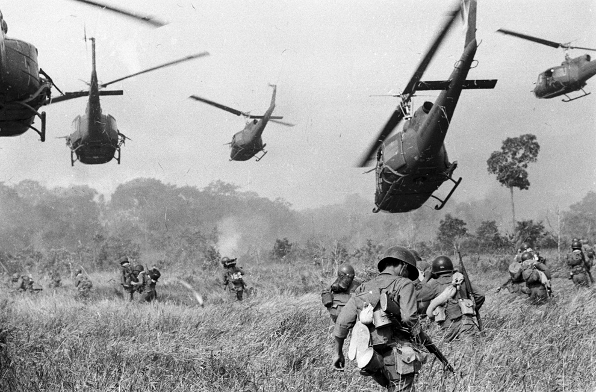

# Introduction

This report uses data that details the aerial bombings during the Vietnam War. The data comes from [Theater History of Operations](https://data.world/datamil/vietnam-war-thor-data) (THOR), which is a database of bombings from World War I through Vietnam begun by the United States Air Force in 2012. Lt. Col. Jenns Robertson, the director of the project, examined thousands of handwritten and typed mission reports to create a comprehensive source of bombing history around the globe. Government agencies have been using the database to find unexploded ordnance in places like Laos and Cambodia, but it also provides a wealth of information for historians of the Vietnam War.^[Bryan Bender, "Bomb database useful for past, present wars," *The Boston Globe,* July 30, 2012, https://www.bostonglobe.com/news/nation/2012/07/29/century-data-and-destruction-chronicled-air-force-officer/5m2HK2CP9UcwwJzMhtdQOO/story.html.]

According to the dataset's dictionary, each observation is defined as an “instance of a unique weapon type or engagement of a unique target.” Meaning if plane A dropped two 500-pound bombs on target one, then one 500-pound bomb on target two, that is listed as two observations. If plane A dropped one 250-pound bomb on target one, and then two more 250-pound bombs on target one, those three bombs are listed as part of the same record—since they were the same type of bomb dropped on the same target. The dataset includes information about the country who dropped the bomb, when it was dropped, who the target was, and what operation it was a part of.

The research questions that this project intends to answer are as follows:

- How did contemporary historical events over the course of the war impact location and frequency of bombs?
- Was there a significant effect in the use of technology over the course of the war?
- Are there noticeable differences in bombing strategies among different combatants or regions?

## Historical Background
Before the end of the 1940s, political unrest and turmoil brewed in Vietnam, but it held little significance to governments around the world. But when the Cold War began, the conflict in Vietnam became intertwined in the struggle between the United States and the Soviet Union. American, Soviet and Chinese leaders arrived at the point of view that Vietnam was crucial to the larger Cold War. They believed that winning the conflict in Vietnam would represent victory in the greater global struggle.^[Mark Atwood Lawrence, *The Vietnam War* (Oxford: Oxford University Press, 2008), 5.]

The original conflict in Vietnam was between the French, who colonized Indochina in the second half of the nineteenth century, and Vietnamese nationalists, led by Ho Chi Minh. After the two sides fought from 1945 until 1954, the Geneva Accords divided Vietnam at the seventeenth parallel; French-led forces moved to the south of the line, and Viet Minh troops to the north. At this time, the United States’ stance on Vietnam was apparent. President Eisenhower said, “The possible consequence of the loss are incalculable to the free world,” warning of the “falling domino principle.” If communism won in Vietnam, Thailand, Malaya, Indonesia, and possibly even Japan would follow.^[Lawrence, *The Vietnam War*, 48.]

The United States sought to prop up and empower an anticommunist state in South Vietnam. But those efforts opposed the Viet Minh, who still hoped to unify all of Vietnam, accompanied by what became known as the Viet Cong, Southern insurgents that allied with the Viet Minh. As insurgency increased in South Vietnam, fear of defeat increased in America, as President Kennedy and then President Johnson worried about a communist victory that would undermine American interests around the world.^[Lawrence, *The Vietnam War*, 68.] So, faced with decision after decision, the United States repeatedly chose in favor of escalation, culminating the United States’ first bombing campaign and introduction of troops in Vietnam in February 1965.^[Lawrence, *The Vietnam War*, 89-90.]

# Methods
Because the dataset contained 4.6 million entries and over 30 variables, it made sense to parse each variable for the most common entries of each. We sorted these tables to begin to identify specific strains of inquiry to answer our research questions. The following are the most significant findings for this early stage.

The United States dropped the vast majority of all bombs, at 85%, followed by South Vietnam at 14%:

```{r, echo = FALSE}
m1 <-
  vietnam.bob %>%
  count(COUNTRYFLYINGMISSION)
m1$pct <- prop.table(m1$n) * 100
m1 <-
m1 %>%
  arrange(desc(pct)) %>%
  head(6) %>%
  filter(COUNTRYFLYINGMISSION != "") %>%
  kable("html") %>%
  kable_styling(bootstrap_options = "striped", full_width = F, position = "center")

m2 <-
  vietnam.bob %>%
  count(MILSERVICE)
m2$pct <- prop.table(m2$n) * 100
m2 <-
m2 %>%
  arrange(desc(pct)) %>%
  head(6) %>%
  filter(MILSERVICE != "") %>%
  kable("html") %>%
  kable_styling(bootstrap_options = "striped", full_width = F, position = "center")

m3 <-
  vietnam.bob %>%
  count(TGTCOUNTRY)
m3$pct <- prop.table(m3$n) * 100
m3 <-
m3 %>%
  arrange(desc(pct)) %>%
  head(6) %>%
  filter(TGTCOUNTRY != "") %>%
  kable("html") %>%
  kable_styling(bootstrap_options = "striped", full_width = F, position = "center")

m4 <-
  vietnam.bob %>%
  count(TGTTYPE)
m4$pct <- prop.table(m4$n) * 100
m4 <-
m4 %>%
  arrange(desc(pct)) %>%
  head(6) %>%
  filter(TGTTYPE != "") %>%
  kable("html") %>%
  kable_styling(bootstrap_options = "striped", full_width = F, position = "center")

m5 <-
  vietnam.bob %>%
  count(MFUNC_DESC)
m5$pct <- prop.table(m5$n) * 100
m5 <-
m5 %>%
  arrange(desc(pct)) %>%
  head(6) %>%
  filter(MFUNC_DESC != "") %>%
  kable("html") %>%
  kable_styling(bootstrap_options = "striped", full_width = F, position = "center")

m6 <-
  vietnam.bob %>%
  count(PERIODOFDAY)
m6$pct <- prop.table(m6$n) * 100
m6 <-
m6 %>%
  arrange(desc(pct)) %>%
  head(5) %>%
  filter(PERIODOFDAY != "") %>%
  kable("html") %>%
  kable_styling(bootstrap_options = "striped", full_width = F, position = "center")
m1
```
Among the U.S. military branches, the Air Force (USAF) dropped most of all. It also did nearly three times as many strikes as the next closest military branch, the South Vietnam Air Force. Both of these findings make sense given that most bombs are dropped from the air:

```{r, echo = FALSE}
m2
```

Over half of all strikes took place over South Vietnam. The next closest target country was Laos, where many of the bombing missions were secretly conducted under Operation Menu. Interestingly, North Vietnam was only bombed 12% of the time, even though it the source of the insurgents that the U.S. was fighting:

```{r, echo = FALSE}
m3
```

The distribution of targets marked for these data showed no type that was obviously popular. The most popular targets, depots and troops, were only about 13% of all strikes each, followed by buildings and vehicles. This suggests that the air campaign touched on many aspects of the overall war strategy in Southeast Asia:

```{r, echo = FALSE}
m4
```

Surprisingly, over two-thirds of all strikes took place during the day rather than the night, while only a slim proportion took place early in the morning or during the evening:

```{r, echo = FALSE}
m6
```

While these insights are useful in understanding the basic elements of the war, we realized we were lacking a perspective on change over time. Using the date and time information for each entry, we sought to understand how these metrics changed during the war.

```{r, echo = FALSE, warning = FALSE, fig.align = "center"}
vietnam.bob %>%
  ggplot(mapping = aes(x = MONTH)) +
  geom_area(stat = "count",
            fill = "darkred") +
  theme_minimal() +
  theme(legend.position = "bottom") +
  labs(title = "Total strikes per month",
       x = "Date",
       y = "Strikes")
```

The number of bombs dropped over the course of the war was not constant, but rather fluctuated. Over the first year and a half, the number of strikes per month doubled to over 30,000 among all combatants. The first spike in bombings occurred midway through 1968, seeming to correspond with the Tet Offensive, the surprise attack launched by the Viet Cong on the Vietnamese New Year. This offensive led to months of heavy ground fighting and air support. The dip in 1969 seems to correspond to the election of President Nixon, who pledged to end U.S. involvement of the war. But on the contrary, the largest spike in the data occurs about a year into his presidency, demonstrating that his promise did not foretell the end of the war. It dragged on another four years, with another increase in strikes in 1972.

```{r, echo = FALSE, warning = FALSE, fig.align = "center"}
vietnam.bob %>%
  filter(COUNTRYFLYINGMISSION != "") %>%
  ggplot(mapping = aes(x = MONTH,
                       fill = COUNTRYFLYINGMISSION)) +
  geom_area(stat = "count",
            position = "fill") +
  scale_x_date() +
  theme_minimal() +
  theme(legend.position = "bottom") +
  scale_fill_brewer(palette = "Spectral",
                    name = "Country",
                    labels = c("AUS",
                               "S. KOREA",
                               "LAOS",
                               "USA",
                               "S. VIETNAM")) +
  labs(title = "Daily bombings by country",
       x = "Date",
       y = "Proportion of Strikes")
```

The only significant change in the proportion of countries conducting bombing seems to have begun in 1973, when the proportion of bombings by the U.S. drastically decreased and South Vietnam took over with three-fourths of all bombing. This shift corresponds to the official end of U.S. involvement on August 15, 1973, when Congress voted to force Nixon to cease all military operations in Vietnam—including air bombings. It was the product of pervasive skepticism over the president's Vietnam policy.^[Lawrence, *The Vietnam War,* 164.] Interestingly, in 1970, Congress had already forced the withdrawal of all U.S. ground troops by 1972, reflecting a rising tide of public opinion against the war. But as these data show, between 1970 and 1972, as the U.S. was decreasing its ground commitment, it still remained as the primary bombing culprit in Southeast Asia.

Because these findings all suggest that the United States was the major aggressor in terms of bombs during the war, we set out to visualize the scale of its toll. By combining geographical data of each bomb strike with historical surveys of the war by published scholars, we sought to answer the question of how military strategy, technology, and politics affected the location and frequency of bombings.

# Results
The following graphs map every bombing mission conducted by the United States during each year of the war. On the whole, the graphs demonstrate that U.S. air involvement in Vietnam began with rather focused bombings in the North and South, but gradually expanded in size and saturation to countries like Laos and Cambodia. Bombing continued well beyond when U.S. officials had promised to leave Vietnam, and despite declining public support for the war. The fact that bombing continued in force for several years after the Nixon administration was promising an end to the war demonstrates the central conundrum of American involvement: why the U.S. maintained its bombing strategy despite mounting evidence that a "victory" was never going to happen.

## American Bombing by Year
Because the United States dropped the majority of bombs until 1974, we decided to analyze the locations of these bombs en masse over the course of war. Using map visualizations, THOR data can supplement secondary sources that recount U.S. strategy in each year to give a more vivid picture of the toll of bombing in Southeast Asia.

### 1965
> *"The loss of Vietnam [would produce] a mean and destructive debate that would shatter my presidency, kill my administration, and damage our democracy." —Lyndon B. Johnson, July 1965.^[Herring, *America's Longest War*, 143.]*

```{r, echo = FALSE}
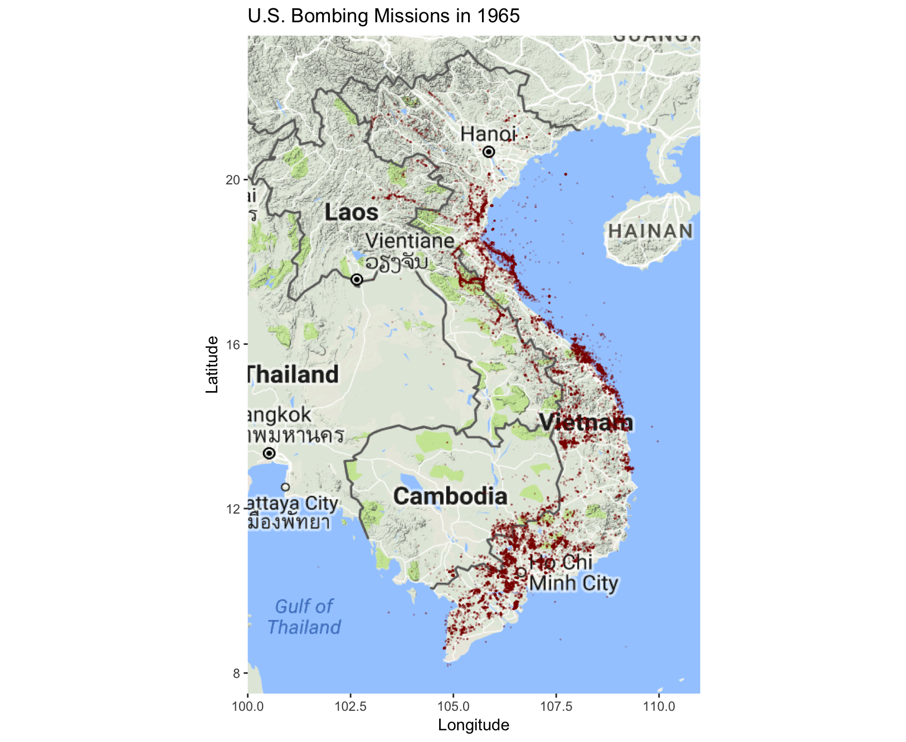
```

In March 1965, President Lyndon B. Johnson initiated the United States’ first bombing campaign of Vietnam, Operation Rolling Thunder, an operation that bombed the North Vietnamese and the Viet Cong in the south, and provided the pretext for introducing the first American ground troops.

When Johnson assumed the presidency in 1963 after John F. Kennedy's death, he inherited a limited American commitment to assist South Vietnam by putting down the North's insurgency. He was also deeply committed to passing Kennedy's progressive "Great Society" legislative program to honor their electoral mandate, leaving him desiring domestic support.

At first he merely increased the number of advisers in Vietnam. But by 1965, as Johnson's advisors believed persistent instability in the South required more intervention, he authorized a sustained air offensive against North Vietnam and the use of American ground forces. "I can't ask our American soldiers out there to continue to fight with one hand behind their backs," Johnson said to the Joint Chiefs of Staff. By July 1965, the U.S. was committed to a major war on the Asian mainland.^[Herring, *America's Longest War*, 108, 130-1.]

### 1966
> *"They had to be pounded with artillery and bombs and eventually brought to battle on the ground if they were not forever to remain a threat." —Gen. William Westmoreland.^[Herring, *America's Longest War*, 151.]*

```{r, echo = FALSE}
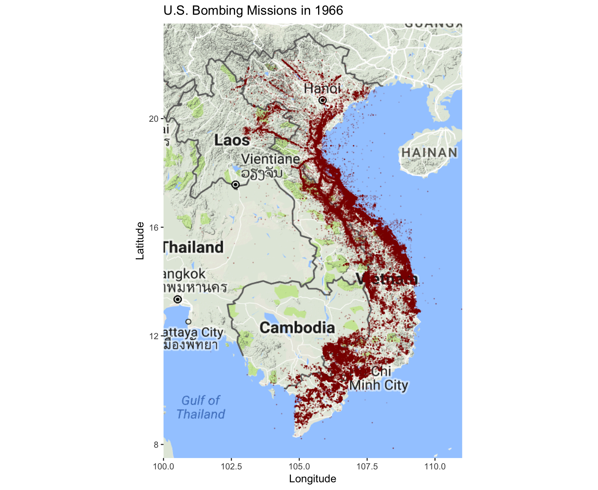
```

While Operation Rolling Thunder was concentrated on military bases and supply depots in the southern part of the country, from early 1966 on the U.S. increasingly directed air strikes against the North Vietnamese industrial and transportation systems.

The Americans relentlessly bombed narrow routes along the Ho Chi Minh trail, a complex system of trails that supplied war materiel to the Viet Cong and North Vietnam. The U.S. attacks were designed to cripple North Vietnam's productivity, but the North coped with the bombing by evacuating civilians from cities and digging over 30,000 miles of tunnels underground, rendering the American attacks less effective.^[Herring, *America's Longest War*, 148-9.]

### 1967
> *"The solution in Vietnam is more bombs, more shells, more napalm ... till the other side cracks and gives up." —Gen. William Depuy, one of the principal architects of search and destroy.^[Herring, *America's Longest War*, 153.]*


```{r, echo = FALSE}
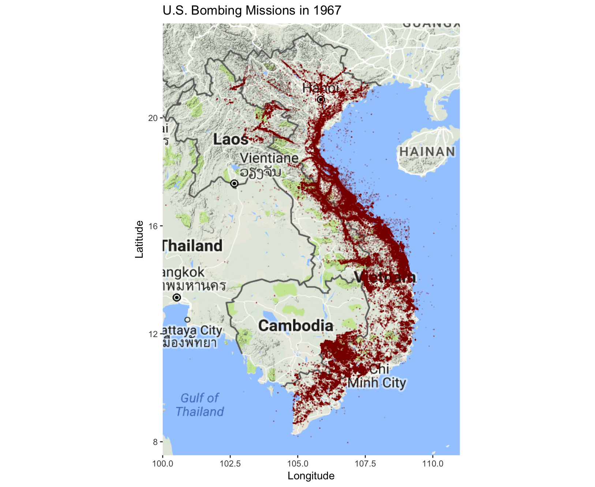
```

The air war gradually grew to massive proportions. By 1967, relying on saturated, indiscriminate air raids, the U.S. designated entire areas of South Vietnam as "free fire zones," which could be decimated without regard for the inhabitants.^[Herring, *America's Longest War*, 153.] 

President Johnson  disagreed with the Joint Chief's proposal for a knock-out blow, but with every bombing campaign that failed to produce results, he expanded the number of targets and the size of strikes against brides, railyards, and barracks in formerly restricted areas. Consensus among the military establishment held that enough bombing could force the enemy to surrender. But the North's ability to withstand the bombing called the validity of this consensus into question. As the ground war of attrition continued, Johnson only expanded the bombing campaigns. And yet, facing growing domestic opposition that threatened his legislative program, he presented an entirely different story to the public. On December 18, 1967, Johnson declared to reporters in Washington, "I am very, very encouraged ... We are making real progress. We have reached an important point where the end begins to come into view."^[Herring, *America's Longest War*, 182.]

### 1968
> *"The first priority foreign policy objective of our next administration will be to bring an honorable end to the war in Vietnam." —Richard Nixon, presidential acceptance speech, August 8, 1968.^[Schmitz, *Richard Nixon and the Vietnam War*, 34.]*


```{r, echo = FALSE}
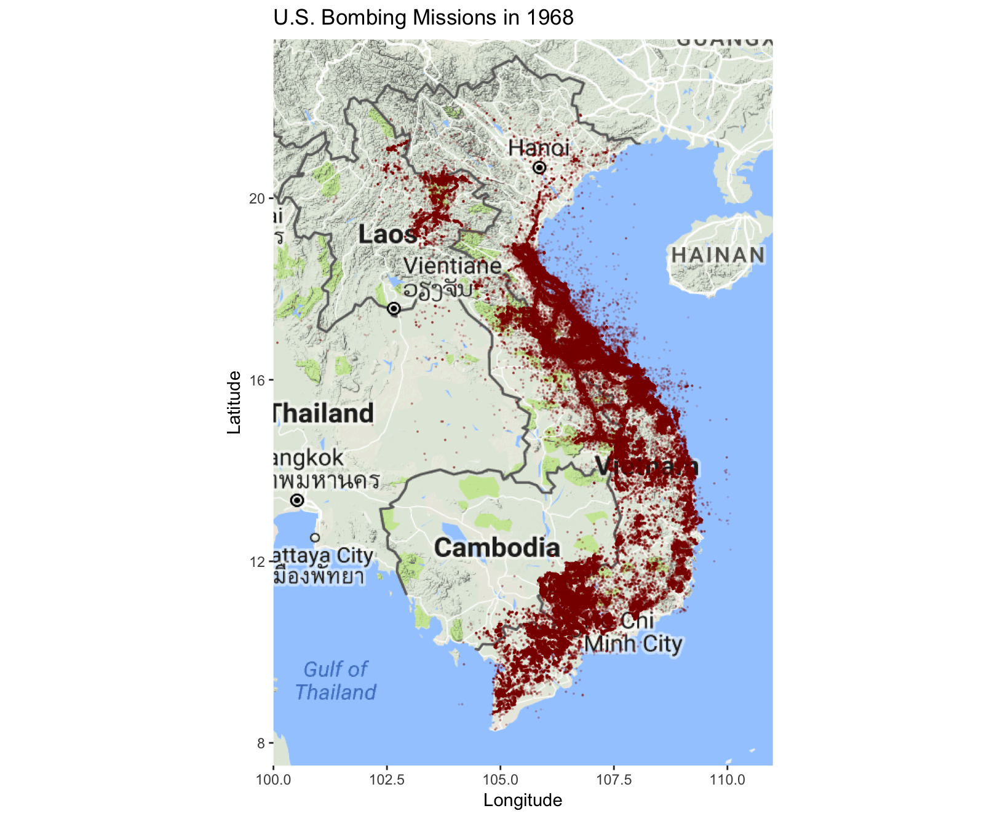
```

In retaliation to the Tet Offensive, the U.S.  expanded the air war in the South, attacking infiltration routes and suspected enemy base camps.

At 2:45 AM on January 31, 1968—or Tet, the Vietnamese New Year—the Viet Cong launched surprise attacks on throughout the country. The Tet Offensive, as it was called, was designed to lure American troops away from major population centers and into remote areas, followed by coordinated Viet Cong attacks on major cities in South Vietnam. The uprising caught the U.S. and South Vietnam completely off guard, and contradicted Nixon's promises that the end was in sight.^[Herring, *America's Longest War*, 209.]

The U.S. also engaged in a 24-day battle for the city of Hue, close to the border between North and South Vietnam. While the focus of this period of the war is on Ho Chi Minh City, the battle of Hue further north was one of the longest and bloodiest battles in the history of urban warfare. Thousands of civilians died in the fight to take back the city, and much of the city's historic monuments and districts were brought to rubble. It received two pages in the 566-page autobiography of Gen. Westmoreland, the Army Chief of Staff during the war.^[Mark Bowden, *Hue 1968: A Turning Point of the American War in Vietnam* (New York: Atlantic Monthly Press, 2017), 522.]

### 1969
> *"I want the North Vietnamese to believe I’ve reached the point where I might do anything to stop the war." —Richard Nixon.^[Schmitz, *Richard Nixon and the Vietnam War*, 69.]*

```{r, echo = FALSE}
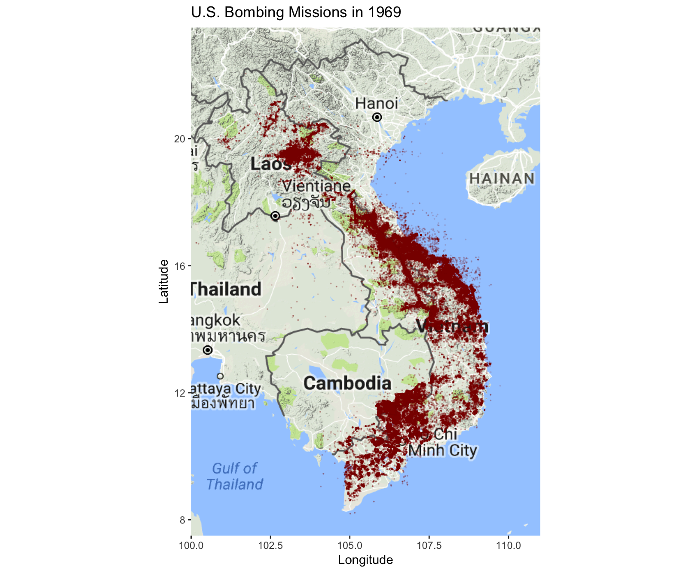
```

Part of President Nixon’s strategy in Vietnam was a peaceful facade that included extending a bombing halt on North Vietnam, but he continued the bombing in South Vietnam and attacked Viet Cong force in Cambodia as a part of his “madman strategy.”

At the beginning of his presidency, Nixon’s contradictory campaign translated into his policy in Vietnam. He created a peaceful facade that called for negotiations to end the war. To further assuage domestic opposition, he announced his policy of Vietnamization to withdraw American troops from Vietnam and hand the fighting over to South Vietnamese forces. But at the same time Nixon pursued his objective of bringing the war to an "honorable end" by using America’s military strength to ensure that South Vietnam’s future was secure, ending the communist threat there.

Nixon initiated covert bombings of Cambodia and Laos, which housed Viet Cong sanctuaries, fearing public rebuke of his strategy to intensify aerial attacks in Indochina. These bombings were a part of Nixon’s “madman strategy” to force concessions from Hanoi militarily and in peace talks by proving to his enemies that he would stop at nothing to achieve his goals in Vietnam.^[Schmitz, *Richard Nixon and the Vietnam War*, 45.]

### 1970
> *"Even without a reason, we ought to go ahead and crack them pretty hard in the North [Cambodia].... The necessity for the North Vietnamese to know that there's still a lot of snap in the old boys is very important. And I don't know any other way to do it." —Richard Nixon, April 1969.^[Schmitz, *Richard Nixon and the Vietnam War*, 51-52.]*

```{r, echo = FALSE}
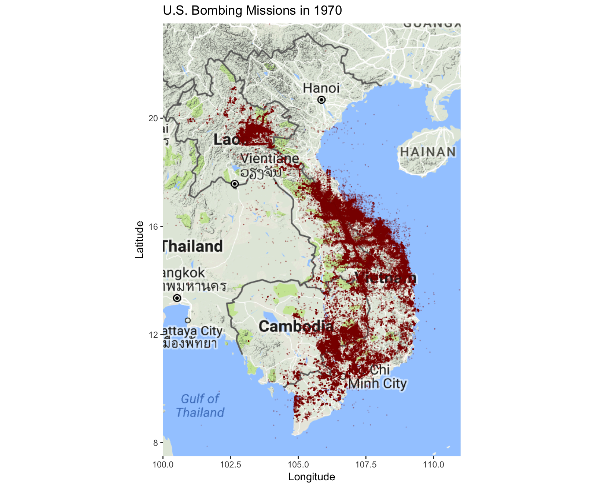
```

The U.S. increased secret bombings in Cambodia and Laos, as seen as this map. But this campaign was unknown to the American public until the release of the Pentagon Papers in 1971.

Nixon’s moves did not force Vietnam to give in, and public demonstrations against America’s involvement in Vietnam persuaded the president to not follow through with his bombing ultimatum. Even as the United States, and increasingly the South Vietnamese enjoyed success on the battlefield, negotiations remained at a stalemate. And 1970 proved to be the downfall of Nixon’s original policy. A pro-western government took over in Cambodia, but was immediately threatened by North Vietnamese forces. The United States expanded its military efforts to Cambodia publicly, including the introduction of ground troops, which disturbed the American public who believed the United States was withdrawing militarily from Indochina.

### 1971
>*"In revealing the workings of government that led to the Vietnam war, the newspapers nobly did precisely that which the Founders hoped and trusted they would do." —Supreme Court Justice Hugo Black, referring to the Pentagon Papers.*

```{r, echo = FALSE}
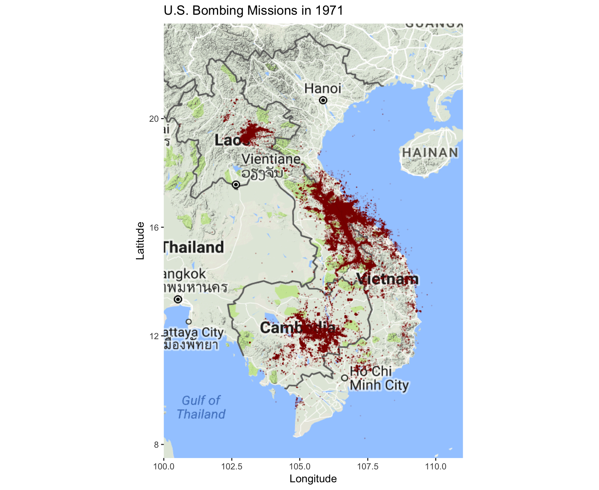
```

Following several military failures and increasing domestic hostility towards the war, Nixon was forced to rein in bombings in Vietnam.

In the middle of 1971, the New York Times started publishing parts of the Pentagon Papers, revealing stark differences between what four consecutive administrations told the American public about Vietnam and their actual policies, actions, and knowledge of the situation.^[Schmitz, *Richard Nixon and the Vietnam War*, 130.] The Nixon administration faced growing public and congressional opposition, as Congress imposed its first actual limits on presidential power in Indochina by forcing the military to remove from Cambodia. A year and a half of additional fighting, expansion of the war to Cambodia, the stalemate continued; Nixon’s policies had failed, and the president would be forced to continue withdraw American troops to try to save his policy, reputation, and presidency.^[Schmitz, *Richard Nixon and the Vietnam War*, 75-104.]

### 1972
> *"Peace is at hand." —Henry Kissinger, October 26, 1972.^[Lawrence, *The Vietnam War*, 158.]*

```{r, echo = FALSE}
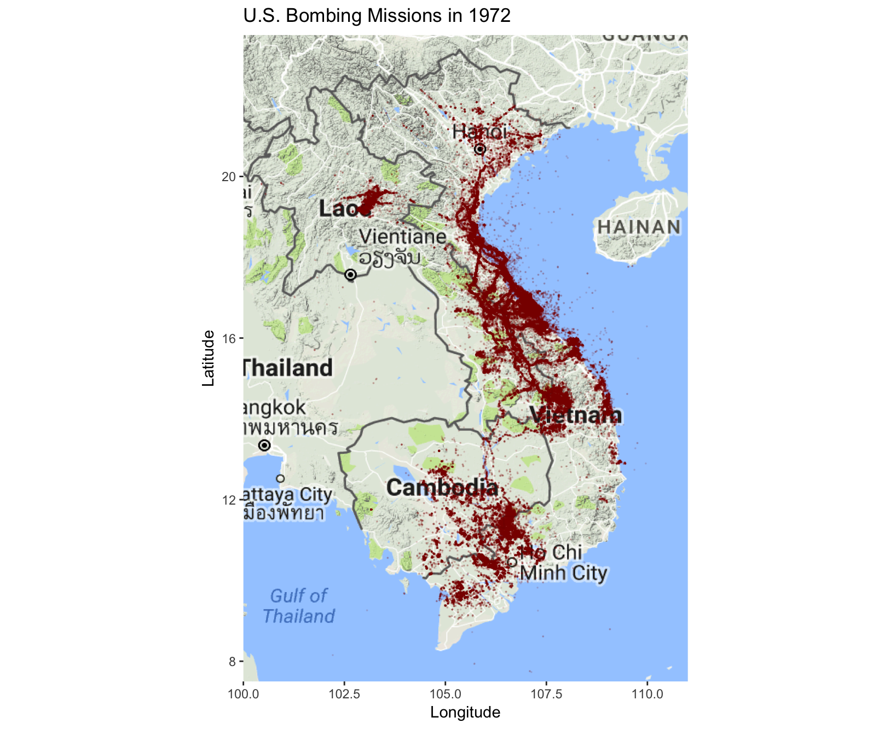
```

Just as the war was supposedly winding down, the U.S. initiated a string of bombings in North Vietnam, near Hanoi, the capital.

In two bombing campaigns in 1972, Operation Linebacker and Linebacker II, Nixon tried to save face in Vietnam by earning some sort of North Vietnamese concession in negotiations. Operation Linebacker II was particularly violent—the ninth day of bombing was the most intense day of aerial bombing in world history.

Nixon had no way to achieve his aims of favorable peace terms, but he strived for an illusory peace to ensure reelection in 1972. He continued to withdraw troops in continuance of his earlier policy, and ran in the 1972 election as a peace candidate. But Nixon was not done in Vietnam and remained committed to supporting South Vietnam.^[Schmitz, *Richard Nixon and the Vietnam War*, 136.] Following North Vietnam’s Spring Offensive on South Vietnam, Nixon chose to initiate Operation Linebacker, bombing North Vietnamese military installations and disrupt supply lines, punishing Hanoi for its attack.^[Schmitz, *Richard Nixon and the Vietnam War*, 139.] The bombings succeeded in halting the offensive and causing destruction, but did nothing to alter the stalemate.

The Nixon administration settled in negotiations with the North Vietnamese, giving into their terms of complete American military force withdrawal from Indochina, recognition of the Viet Cong’s political organization as the legal authority in the territory it controlled, and establishment of a national council to decide Vietnam’s political future.^[Schmitz, *Richard Nixon and the Vietnam War*, 140.]

Instead, a month after Nixon's landslide election on November 7, the president launched Operation Linebacker II.^[Schmitz, *Richard Nixon and the Vietnam War*, 140.] He chose around-the-clock bombings in Hanoi and Haiphong to force North Vietnam back to the negotiations and to make concessions, and to demonstrate to South Vietnam the United States still backed them. "I'd finish off the goddamn place," Nixon said in November. "Just knock the shit out of them."^[Schmitz, *Richard Nixon and the Vietnam War*, 138.] The bombings succeeded in convincing Nguyen Van Thieu, the South Vietnamese president, to allow the treaty, but did nothing to change the terms.

### 1973
> *"We today have concluded an agreement to end the war and bring peace with honor in Vietnam and in Southeast Asia." —Richard Nixon, January 23, 1973.^[Schmitz, *Richard Nixon and the Vietnam War*, 143.]*

```{r, echo = FALSE}
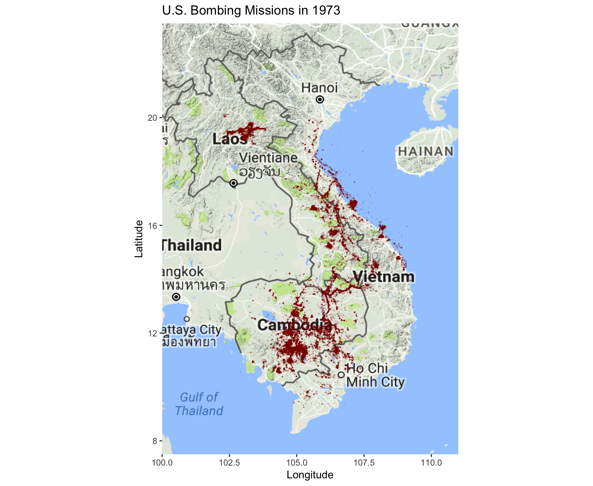
```

Within 60 days of Nixon announcing an end to the war, all American forces would be withdrawn and bombing stopped. But there were still last vestiges of bombing by the U.S.

No one expected peace in Vietnam because North Vietnamese troops remained in the South without an American threat looming. Fighting continued in 1973 and 1974, then on April 18, 1975, Saigon fell to North Vietnamese and Viet Cong troops. North and South Vietnam were unified the next year as the Socialist Republic of Vietnam. Fought as a proxy war in stopping the spread of communism, America's longest war had ended in failure.

## The Rise of the B-52
With Nixon declaring his intention to secure "peace with honor" beginning as early as 1968, why he would launch a new bombing campaign in the North in 1972 was puzzling. Based on a hypothesis that changing technology and strategy might have been playing a role, we sought to find these effects in the data.

The Boeing B-52 Stratofortress is a long-range, subsonic, jet-powered strategic bomber introduced to the USAF in 1955. The bomber can carry up to 70,000 pounds of weapons, and can travel 8,800 miles without refueling.

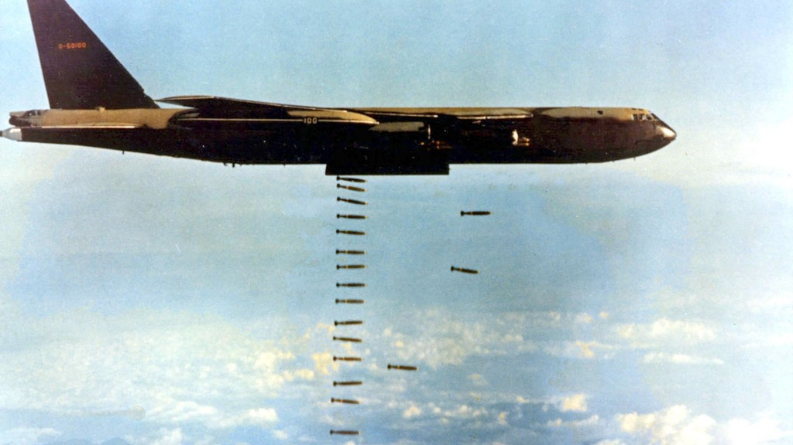

```{r, echo = FALSE, warning = FALSE, fig.align = "center"}
vietnam.bob %>%
  filter(VALID_AIRCRAFT_ROOT == "B-52") %>%
  filter(MILSERVICE == "USAF") %>%
  ggplot(mapping = aes(x = MONTH)) +
  geom_area(stat = "count",
            fill = "darkred") +
  theme_minimal() +
  theme(legend.position = "bottom") +
  labs(title = "Use of B-52 aircraft by USAF",
       x = "Date",
       y = "Proportion")
```

The data show that the U.S. Air Force drastically increased its usage of B-52 aircraft beginning in 1972. And in December of that year, USAF directed most of its B-52s to bomb Hanoi and Haiphong, the capital and second-largest city of the North Vietnam. This was known as the "Christmas bombings," or Operation Linebacker II.

## The Christmas Bombings
From December 18 to December 28, 1972, the U.S. dropped more than 36,000 tons of bombs on the North. Unlike Operation Rolling Thunder, Linebacker II was to be a "maximum effort" bombing campaign to destroy target complexes in the North and force peace talks. The use of B-52s meant these bombings could be carried out with less weapons of more weight. The graph below compares the number of weapons to total tonnage for strikes in North and South Vietnam during the 11 days of Linebacker II.

```{r, echo = FALSE, warning = FALSE, fig.align = "center"}
numbombs1 <-
vietnam.bob %>%
  filter(TGTCOUNTRY == "SOUTH VIETNAM" | TGTCOUNTRY == "NORTH VIETNAM") %>%
  filter(COUNTRYFLYINGMISSION == "UNITED STATES OF AMERICA") %>%
  filter(MSNDATE >= "1972-12-1" & MSNDATE <= "1973-1-1") %>%
  ggplot(aes(x = MSNDATE,
             y = NUMWEAPONSDELIVERED)) +
  geom_bar(stat = "identity",
           fill = "darkred") +
  facet_wrap(~TGTCOUNTRY) +
  theme_minimal() +
  labs(title = "American Bombs by Target Country",
       x = "Day in 1972",
       y = "Number of Bombs in Strike")

tonnage1 <-
vietnam.bob %>%
  filter(TGTCOUNTRY == "SOUTH VIETNAM" | TGTCOUNTRY == "NORTH VIETNAM") %>%
  filter(COUNTRYFLYINGMISSION == "UNITED STATES OF AMERICA") %>%
  filter(MSNDATE >= "1972-12-1" & MSNDATE <= "1973-1-1") %>%
  ggplot(aes(x = MSNDATE,
             y = NUMWEAPONSDELIVERED*WEAPONTYPEWEIGHT/2000)) +
  geom_bar(stat = "identity",
           fill = "darkred") +
  facet_wrap(~TGTCOUNTRY) +
  theme_minimal() +
  labs(x = "Day in 1972",
       y = "Tonnage of Strike")
grid.arrange(numbombs1, tonnage1,
             nrow = 2)
```

The bombings in those 11 days exceeded the tonnage used during the entire period from 1969 to 1971,^[Herring, *America's Longest War*, 248.] as demonstrated here:

```{r, echo = FALSE, warning = FALSE, fig.align = "center"}
vietnam.bob %>%
  filter(TGTCOUNTRY == "SOUTH VIETNAM" | TGTCOUNTRY == "NORTH VIETNAM") %>%
  filter(COUNTRYFLYINGMISSION == "UNITED STATES OF AMERICA") %>%
  ggplot(aes(x = MSNDATE,
             y = NUMWEAPONSDELIVERED*WEAPONTYPEWEIGHT/2000)) +
  geom_bar(stat = "identity",
           fill = "darkred") +
  facet_wrap(~TGTCOUNTRY) +
  theme_minimal() +
  labs(x = "Date",
       y = "Tonnage of Strike")
```

The Christmas bombings evoked outrage around the world, amongst the Soviets, Chinese, and Americans themselves. At home, critics were shocked, denouncing Nixon as a “madman” and accusing him of waging “war by tantrum.” Sen. George Aiken (D-VT) called the attacks a “sorry Christmas present” for the American people.^[Herring *America’s Longest War*, 248.]

## Modeling the Christmas Bombings
At the same time as Linebacker II, the U.S. was continuing its bombing of South Vietnam. The general consensus is that the Christmas bombings in the North saw extreme amounts of decimation caused by heavy bombs; but was this statistically significant? We set out to model the Christmas bombings by seeing if the weight of could predict whether a strike took place in the North or the South during the date range. We used a generalized linear model of the binomial family and found a p-value of 2e-16.

```{r, echo = FALSE, warning = FALSE, fig.align = "center"}
christmas2 <- vietnam.bob %>%
  filter(MSNDATE >= "1972-12-18" & MSNDATE <= "1972-12-28") %>%
  filter(TGTCOUNTRY == "NORTH VIETNAM" | TGTCOUNTRY == "SOUTH VIETNAM")

#Christmas bombings model
xmas.model <- glm(factor(TGTCOUNTRY) ~ WEAPONSLOADEDWEIGHT, data = christmas2, family = "binomial")


x.vals <- seq(0:2650650)
pred.probs <- predict.glm(xmas.model,
                          data.frame(WEAPONSLOADEDWEIGHT = x.vals),
                          type = "response")
christmas.weight.data <- data.frame(WEAPONSLOADEDWEIGHT = x.vals, `South Vietnam` = pred.probs,
                                    `North Vietnam` = 1-pred.probs)

long.xmas.data <- christmas.weight.data %>%
  gather(key = "Country Bombed", value = "Probability", -WEAPONSLOADEDWEIGHT)

long.xmas.data %>%
  ggplot(aes(x=WEAPONSLOADEDWEIGHT/2000, y=Probability, colour=`Country Bombed`)) +
  geom_line() + 
  labs(title = "Probability of Target Country in the Christmas Bombings",
       x = "Tonnage of Strike",
       y = "Probability")
```

This model demonstrates that the bombing of North Vietnam, specifically Hanoi, the capital, and Haiphong, the country’s second-largest city, experienced heavier bombs than the campaign in the South occurring during the same time period. As the tonnage of a strike increased, it became more and more likely that the strikes were on North Vietnam. This supports the historical scholarship on the Christmas bombing which suggests that B-52s were used to bomb Hanoi and Haiphong using heavier and deadlier bombs.

# Conclusion
> *"The bastards have never been bombed like they're going to be bombed this time." —Richard Nixon, April 4, 1972.^["Nixon on Bombing Recorded in Tape," *The New York Times*, June 30, 1974, https://www.nytimes.com/1974/06/30/archives/nixon-on-bombing-recorded-in-tape-reason-for-moving.html.]*

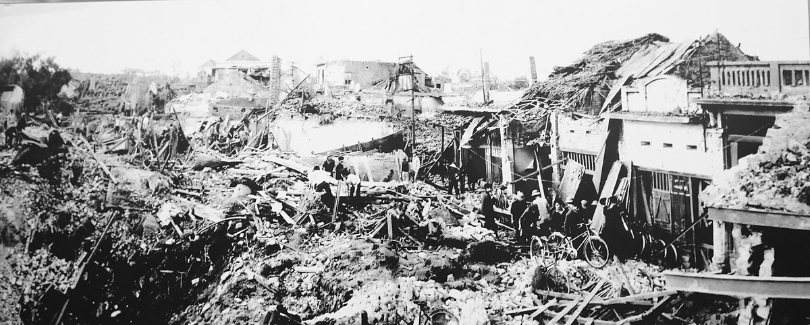

The Christmas bombing devastated Hanoi and Haiphong, destroying factories, power plants, residential districts, and transportation stations, while killing as many as 2,200 civilians. Nixon agreed to suspend the bombing if North Vietnam agreed to resume peace talks; they did. But the agreement reached barely met Nixon’s minimal terms for “peace with honor.” Under the terms, the U.S. could exit the war, but North Vietnamese troops could remain in the south. The ultimate question that drew the United States into the war in the first place—the political future of South Vietnam—was left undecided. Ultimately, the future Americans favored fell with Saigon in 1975.^[Herring *America’s Longest War*, 249-50.]

The research questions we set out to answer were as follows:

- How did contemporary historical events over the course of the war impact location and frequency of bombs?
- Was there a significant effect in the use of technology over the course of the war?
- Are there noticeable differences in bombing strategies among different combatants or regions?

Throughout the project, we visualized the 4.6 million aerial missions of the Vietnam War and placed them in the context existing historical scholarship. This process gave us answers to those questions.

The Christmas bombing was an example of how historical events impacted the location and frequency of bombs, as were Nixon’s secret bombings of Cambodia and Laos and Johnson’s response to the Tet Offensive. Throughout the war, during both Johnson’s and Nixon’s presidencies, the data and corresponding graphs and maps display spikes in bombing. Beginning with Operation Rolling Thunder, and ending with the Christmas bombing, the United States dropped the overwhelming majority of bombs during the Vietnam War.

The maps demonstrate how bombing escalated first in 1965, and grew to be enormous from 1966 until 1971, when the American public and Congress forced the Nixon administration to curtail its aerial efforts. Even after that point, Nixon still called for two intense bombing campaigns in 1972, using B-52s to drop enormous amounts of weaponry in Operations Linebacker and Linebacker II. During that operation, the U.S. managed to bomb North Vietnam with fewer, but heavier, strikes than in the South.

What this data shows is that there was no peace with honor; the end was never truly in sight. Ironically, for all the mistakes, miscalculations, and war crimes committed by the U.S. government and military during the Vietnam War, it was a lieutenant general at the U.S. Air Force who helped compile the THOR database. In providing the public with military records dating back to World War I, THOR produced something of a mirror—one that shows the truth of the United States' legacy.

This project focused in large part on one of the most gruesome bombings of the entire war. What about the smaller bombings that did not make the history books, the ones that took place in remote parts of the countryside, destroying lives and livelihoods? What about the unexploded bombs still lying in places unknown?

There is more work to be done.

# Bibliography
Bowden, Mark. *Hue 1968: A Turning Point of the American War in Vietnam.* New York: Atlantic Monthly Press, 2017.

Herring, George C. *America’s Longest War: The United States and Vietnam, 1950–1975.* New York: John Wiley & Sons, 1979.

Lawrence, Mark Atwood. *The Vietnam War: A Concise International History.* Oxford: Oxford University Press, 2008.

Schmitz, David F. *Richard Nixon and the Vietnam War: The End of the American Century.* Lanham, Md.: Rowman & Littlefield, 2014.